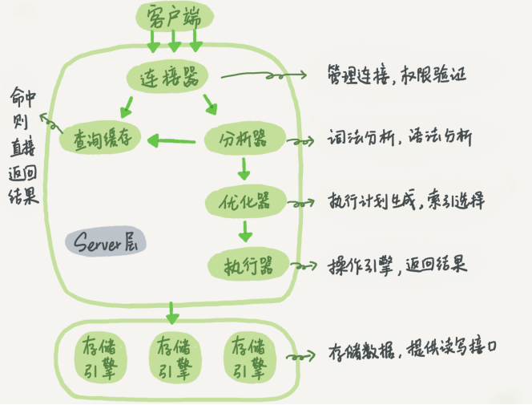

# MySQL 逻辑架构

```
1.连接层
2.服务层（优化与执行）
3.引擎层
4.查询过程
```


## 1.连接层
```
当客户端（应用程序）连接到MySQL服务器时进行认证（使用主机、账户和密码 或者使用ssl连接）。
一旦客户端连接成功就验证客户端是否具有执行权限。
```

## 2.服务层（优化与执行）
```
这层MySQL的核心部分。通常叫做 SQL Layer。在 MySQL据库系统处理底层数据之前的所有工作都是在这一层完成的，
包括权限判断， sql解析，行计划优化， query cache 的处理以及所有内置的函数(如日期,时间,数学运算,加密)等等。
各个存储引擎提供的功能都集中在这一层，如存储过程，触发器，视 图等。

对于SELECT查询语句，解析查询之前会先查询缓存，如果缓存能找到就直接返回查询结果，
如果缓存查找不到，就会解析查询，创建解析树，然后对其进行查询优化、决定表的读取顺序、选择合适的索引等
最后使用执行器操作存储引擎返回查询结果。
```

## 3.引擎层
```
存储引擎负责MySQL中数据的存储和提取。
服务层通过API与存储引擎进行通信。不同的存储引擎具有的功能不同，
这样我们可以根据自己的实际需要进行选取。最常用的则是MyISAM和InnoDB。
```

## 4.查询过程
```
MySQL 整个查询执行过程，总的来说分为 6 个步骤 :
SQL执行步骤：请求、缓存、SQL解析、优化SQL查询、调用引擎执行，返回结果
    1、连接：客户端向 MySQL 服务器发送一条查询请求，与connectors交互：连接池认证相关处理。
    2、缓存：服务器首先检查查询缓存，如果命中缓存，则立刻返回存储在缓存中的结果，否则进入下一阶段
    3、解析：服务器进行SQL解析(词法语法)、预处理。
    4、优化：再由优化器生成对应的执行计划。
    5、执行：MySQL 根据执行计划，调用存储引擎的 API来执行查询。
    6、结果：将结果返回给客户端，同时缓存查询结果。
```

**参考资料**
[MySQL架构原理(详解)](https://blog.csdn.net/hguisu/article/details/7106342)